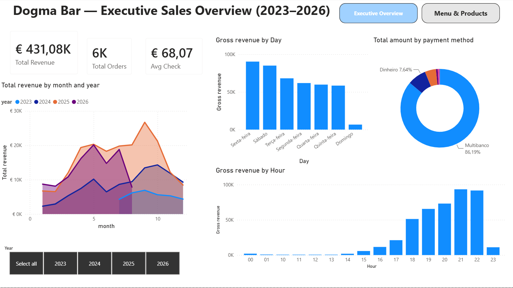
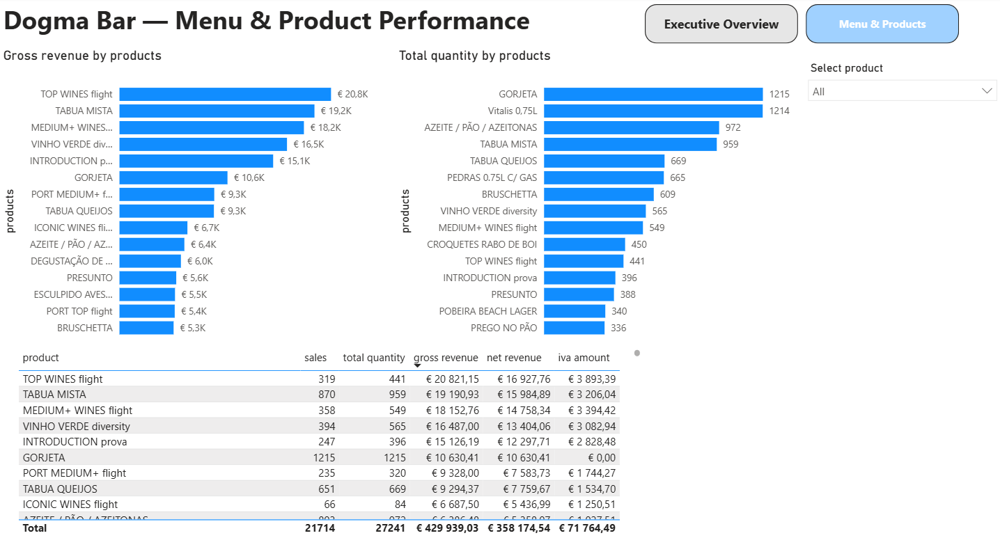

# 🍷 Dogma Bar — Sales & Product Performance Analytics

An **End-to-End Business Intelligence and Data Analytics solution** built for a commercial bar/restaurant located in Porto, Portugal. 

This project transforms raw POS transaction data into interactive executive reporting to monitor revenue dynamics, peak operating hours, payment method splits, and SKU-level product profitability.

---

## 📸 Dashboard Preview

### Page 1: Executive Sales Overview

### Page 2: Menu & Product Performance

---

## 🛠 Tech Stack & Architecture

- **Database / Data Source:** PostgreSQL (relational POS schema, order transaction logs, product catalog).
- **Data Transformation & Cleaning:** SQL (aggregations, views, date parsing, IVA/VAT extraction, and currency handling).
- **Business Intelligence & Viz:** Microsoft Power BI Desktop.
- **Key DAX & Modeling:** Measures for Gross/Net Revenue, VAT calculations, average check size, dynamic Top-N filtering, and interactive Page Navigation.

---

## 📊 Key Business Insights

1. **Executive Performance:**
   - **Total Turnover:** Analyzed **€431.08K** in gross revenue across **6,000+ customer orders**.
   - **Average Check:** Stable average order ticket of **€68.07**.
   - **Payment Structure:** Highly digitalized cashflow — **86.19% Multibanco (Card)** vs. **7.64% Cash (Dinheiro)**.

2. **Operational Load & Seasonality:**
   - **Peak Hours:** Over **70% of daily revenue** is concentrated between **18:00 and 23:00**, peaking at **21:00–22:00**.
   - **Weekly Distribution:** Friday (*Sexta-feira*) and Saturday (*Sábado*) are the primary revenue drivers, generating more than **45% of weekly turnover**.

3. **Product & Menu Matrix:**
   - **Revenue Leaders:** High-margin tasting sets and boards (*TOP WINES flight* — €20.8K, *TÁBUA MISTA* — €19.2K, *MEDIUM+ WINES flight* — €18.1K).
   - **Volume Leaders:** Complementary and high-turnover items (*Gorjeta* tips, bottled water *Vitalis*, bread & olive sets *Azeite / Pão / Azeitonas*).

---

## 📁 Repository Structure

- [`Dogma_project.pbix`](Dogma_project.pbix) — Complete Power BI project file with data models and dashboards.
- [`project_Dogma.pdf`](project_Dogma.pdf) — Printable executive PDF export.
- `dogmashowscreen1.png`, `dogmashowscreen2.png` — Dashboard screenshots.

---

## 👤 Author
**Pavel Kostiuchenkov**  
*Data Analyst & Business Intelligence Specialist*  
📍 Porto, Portugal
